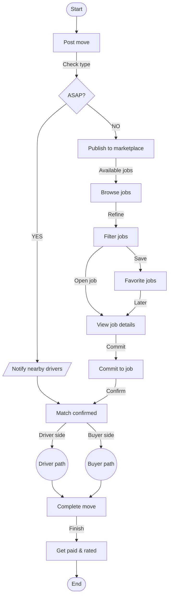

# Kyydissä SaaS User Flow & Architecture Reference

> **Source File:** `~/Downloads/flow_chart.pdf`  
> **Purpose:** Single Source of Truth (SSOT) for two-sided marketplace state transitions, posting paths, fulfillment, and payment flows.

---

## 1. Visual Flowchart (Mermaid.js)

---

## 2. Detailed State Machine & Process Steps

### Phase 1: Creation & Dispatch (`Post move`)
1. **User Initiates Post**: Enters furniture title, pickup/dropoff areas, optional physical metrics (dimensions/weight), and price reward.
2. **Type Check (`ASAP?`)**:
   * **`YES` (Instant Pickup / `PickupRequest`)**: Triggers real-time notification dispatch (`Notify nearby drivers`) to local commuters with matching routes.
   * **`NO` (Flexible Rehoming / `ItemAvailable`)**: Published to open marketplace feed (`Publish to marketplace`).

### Phase 2: Discovery & Commitment (`Browse` -> `Commit`)
1. **Discovery**: Drivers browse (`Browse jobs`) and refine results by pickup location (`Filter jobs`).
2. **Saved State**: Drivers can favorite listings (`Favorite jobs`) to review later.
3. **Commitment**: Driver views full job details (`View job details`) and commits to transporting the item (`Commit to job`).
4. **Match Confirmation**: API processes job acceptance, locking the post status to `Accepted` (`Match confirmed`).

### Phase 3: Parallel Fulfillment (`Driver Path` & `Buyer Path`)
* **Driver Path**: Provides pickup route navigation, ETA updates, and pickup confirmation.
* **Buyer Path**: Provides real-time driver tracking and direct in-app communication.

### Phase 4: Settlement & Feedback (`Get paid & rated`)
1. **Completion**: Driver marks item delivered (`Complete move`).
2. **Escrow Release & Rating**: Payout is disbursed to driver, and both parties exchange ratings and reviews (`Get paid & rated`).
